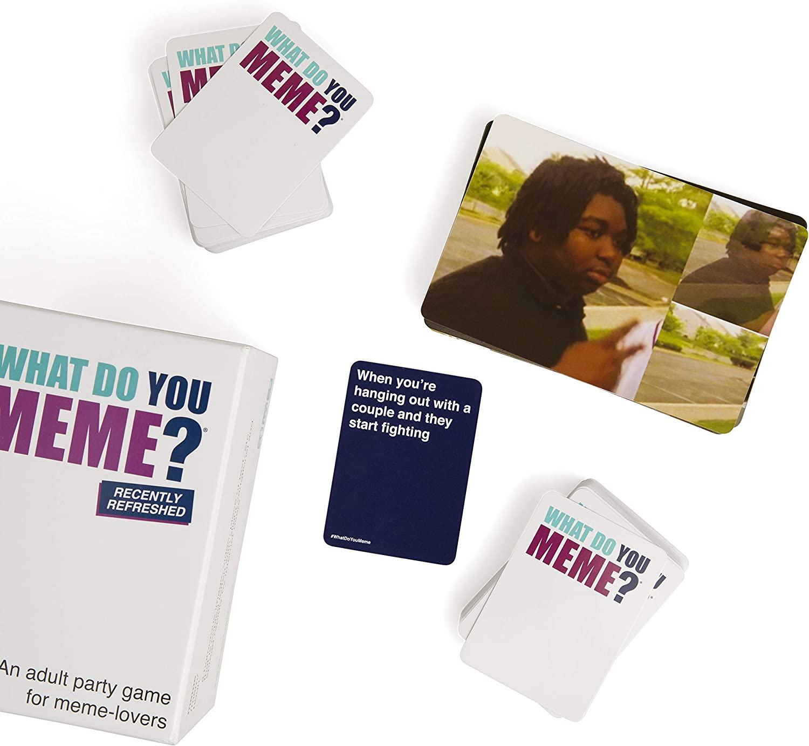

# What Do You Meme...
...ist ein Kartenspiel. Ein Spieler zieht ein Bild und die anderen Spieler müssen ein lustiges Quote dazu finden. Danach wird das beste Quote gewählt.

## Grundstruktur des Projekts
Das Projekt besteht aus drei Entitäten:
- Quote: Text, der einem Bild zugeordnet werden kann (siehe blaue Karte oben) 
- Picture: Bild, zu einem Text das gewählt werden kann (siehe Bild oben)
- Meme: die Kombination aus Bild und Text

Diese Entitäten werden folgenden Datenfeldern und Funktionen haben:
- Picture
    - id
    - name
    - kategorie
    - url from mememaker.github.io/api
    - Funktionen:
        - addPicture (Bild hinzufügen)
        - getAllPictures (alle Bilder anzeigen)
        - getPictureByID (bestimmtes Bild anzeigen)
        - getRandomPicture (zufälliges Bild anzeigen)
        - deletePicture (Bild löschen)
        - updatePicture (Bildinformation updaten)
        - favoritePicture (Bild mit den meisten Likes)
- Quote
    - id
    - text
    - Funktionen:
        - addQuote (Text hinzufügen)
        - getAllQuotes (alle Texte anzeigen)
        - get4RandomQuotes (4 zufällige Texte anzeigen)
        - favoriteQuote
        - deleteQuote (Text löschen)
        - updateQuote (Textinformation aktualisieren)
- Meme
    - id
    - datetime
    - pictureid
    - quoteid
    - likes

Funktionen: 
Boilerplate
Standard-Crud

Picture:

Quote:

Matches: 
addMatch
deleteMatch
showLast5Matches
getAllMatches
getAllMatchesAfter(Datetime)
getMatchByID
getFavoriteMatch (meiste Likes)
addLike

~ deleteMatchPictureQuote

## Backend mit Spring Boot

## Thymeleaf

## JS